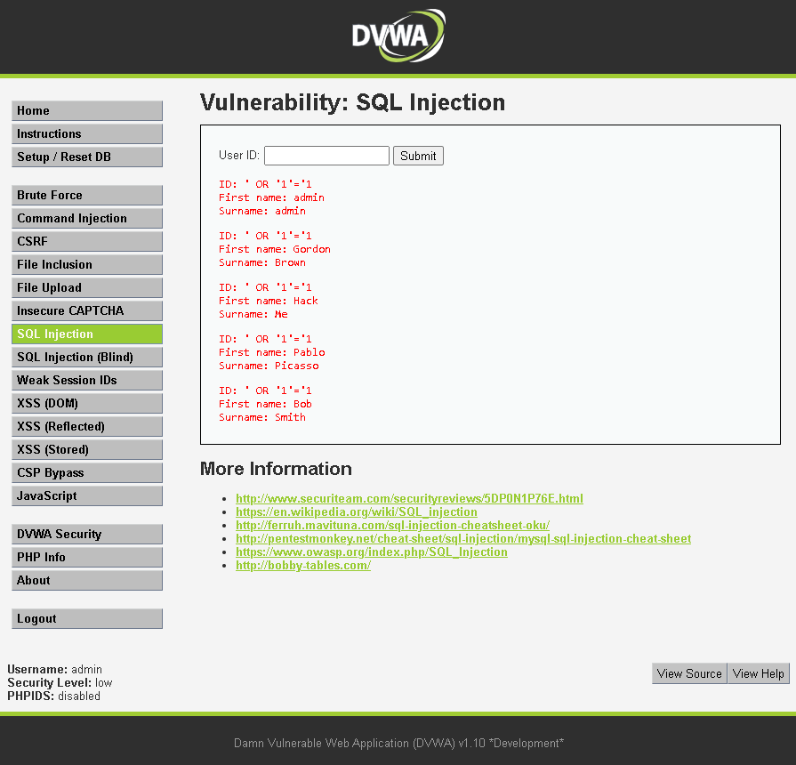

# Inyección SQL (SQL Injection)

## 1. Evidencia del Ataque

**Payload utilizado:**  
```
' OR '1'='1
```

**Entrada:** Campo de búsqueda de estudiantes  
**Resultado:** Exposición de toda la base de datos de estudiantes y calificaciones


*La captura mostrará el navegador con DVWA y el resultado de la inyección SQL exponiendo todos los registros de la base de datos.*

---

## 2. ¿Por Qué Funciona Esta Vulnerabilidad?

### Problema Técnico

El código vulnerable es similar a:
```php
$query = "SELECT * FROM students WHERE name = '" . $_GET['name'] . "'";
$result = mysqli_query($connection, $query);
```

### Análisis

Sin escapar la entrada del usuario, la aplicación **concatena directamente** el valor ingresado en la consulta SQL. Cuando ingresamos:
```
' OR '1'='1
```

La consulta se convierte en:
```sql
SELECT * FROM students WHERE name = '' OR '1'='1'
```

**Porque funciona:**
- `'` cierra la cadena original
- `OR '1'='1'` agrega una condición siempre verdadera
- Todas las filas cumplen la condición, exponiendo toda la base de datos

---

## 3. Puntaje CVSS

| Métrica | Valor |
|---------|-------|
| **CVSS v3.1** | **9.8** |
| **Severidad** | CRÍTICA |
| **Vector** | CVSS:3.1/AV:N/AC:L/PR:N/UI:N/S:U/C:H/I:H/A:H |

**Justificación:**
- **AV:N** (Red): Explotable remotamente
- **AC:L** (Bajo): Sin complejidad
- **PR:N** (Sin permisos): No requiere autenticación
- **UI:N** (Sin interacción): Sin intervención del usuario
- **C:H** (Alto): Pérdida total de confidencialidad
- **I:H** (Alto): Pérdida total de integridad
- **A:H** (Alto): Pérdida total de disponibilidad

---

## 4. Política de Prevención

### Medida Principal: Consultas Parametrizadas

**Código Seguro (Prepared Statements):**
```php
$query = "SELECT * FROM students WHERE name = ?";
$stmt = $connection->prepare($query);
$stmt->bind_param("s", $_GET['name']);
$stmt->execute();
$result = $stmt->get_result();
```

**O con PDO:**
```php
$query = "SELECT * FROM students WHERE name = :name";
$stmt = $connection->prepare($query);
$stmt->execute([':name' => $_GET['name']]);
```

### ¿Por qué es seguro?
- El parámetro se envía **separadamente** de la estructura SQL
- La base de datos **nunca interpreta** el valor como código
- El carácter `'` se trata como dato, no como sintaxis

### Medidas Complementarias

1. **Validación en entrada:** Solo permitir caracteres esperados (nombres, etc.)
2. **Escape de caracteres:** Si no puedes usar prepared statements
   ```php
   $escaped = $connection->real_escape_string($_GET['name']);
   ```
3. **Principio de mínimo privilegio:** El usuario BD solo lee, no tiene permisos de DELETE/DROP
4. **WAF (Web Application Firewall):** Detectar patrones SQLi conocidos

---

## 5. Controles de Mitigación

### Control Inmediato
- Implementar prepared statements en **todos** los campos de entrada
- Realizar auditoría de código para identificar otros puntos vulnerables

### Control Detectivo
- Registrar consultas SQL anómalas (intentos de UNION, comentarios, etc.)
- Alertas ante múltiples fallos de consulta

### Control de Recuperación
- Backup diario de la base de datos
- Plan de restauración de datos en caso de modificación no autorizada

---

## Referencia
- **OWASP**: https://owasp.org/www-community/attacks/SQL_Injection
- **CWE-89**: SQL Injection
- **NIST**: SP 800-53 SI-10 (Information System Monitoring)
