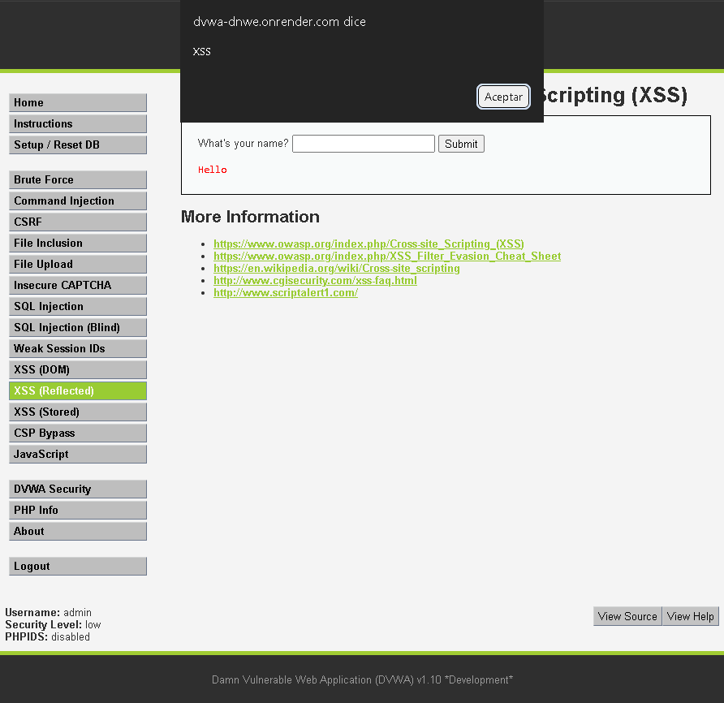

# Cross-Site Scripting (XSS - Reflected)

## 1. Evidencia del Ataque

**Payload utilizado:**  
```
<script>alert('XSS')</script>
```

**Entrada:** Campo de búsqueda o comentarios  
**Resultado:** Ejecución de código JavaScript en el navegador de la víctima


*La captura mostrará el navegador con DVWA y la ventana alert() apareciendo, demostrando ejecución de JS.*

---

## 2. ¿Por Qué Funciona Esta Vulnerabilidad?

### Problema Técnico

El código vulnerable es similar a:
```php
<?php
$user_input = $_GET['search'];
echo "Resultados para: " . $user_input;
?>
```

### Análisis

Sin escapar la salida HTML, el navegador **interpreta el código ingresado como JavaScript**. Cuando ingresamos:
```html
<script>alert('XSS')</script>
```

El navegador recibe:
```html
<html>
  <body>
    Resultados para: <script>alert('XSS')</script>
  </body>
</html>
```

**El navegador ejecuta el script** porque es HTML válido.

### Variante: XSS Stored (más peligrosa)
Si en lugar de reflejado, se guarda en BD, afecta a **todos los usuarios** que visualicen ese contenido.

---

## 3. Puntaje CVSS

| Métrica | Valor |
|---------|-------|
| **CVSS v3.1** | **8.2** |
| **Severidad** | ALTA |
| **Vector** | CVSS:3.1/AV:N/AC:L/PR:N/UI:R/S:C/C:H/I:H/A:N |

**Justificación:**
- **AV:N** (Red): Explotable remotamente
- **AC:L** (Bajo): Sin complejidad
- **PR:N** (Sin permisos): No requiere autenticación
- **UI:R** (Requiere interacción): Necesita que la víctima haga clic en link
- **S:C** (Cambiado): Afecta más allá del contexto del atacante
- **C:H** (Alto): Robo de cookies/tokens
- **I:H** (Alto): Modificación del DOM, phishing
- **A:N** (Ninguno): No afecta disponibilidad

---

## 4. Política de Prevención

### Medida Principal: Output Encoding (HTML Encoding)

**Código Seguro (PHP):**
```php
<?php
$user_input = $_GET['search'];
echo "Resultados para: " . htmlspecialchars($user_input, ENT_QUOTES, 'UTF-8');
?>
```

**Convierte:**
- `<` → `&lt;`
- `>` → `&gt;`
- `"` → `&quot;`
- `'` → `&#039;`

El navegador **muestra el texto literalmente**, no lo interpreta como HTML.

**En JavaScript (si es necesario mostrar en JS):**
```javascript
const userInput = "<%userInput%>";
const safeInput = userInput
  .replace(/&/g, '&amp;')
  .replace(/</g, '&lt;')
  .replace(/>/g, '&gt;')
  .replace(/"/g, '&quot;')
  .replace(/'/g, '&#39;');
```

### Medidas Complementarias

1. **Content Security Policy (CSP):** Restricción de inline scripts
   ```html
   <meta http-equiv="Content-Security-Policy" 
         content="script-src 'self'; object-src 'none'">
   ```

2. **X-XSS-Protection Header:**
   ```
   X-XSS-Protection: 1; mode=block
   ```

3. **Template Engines Seguros:**
   - React: Escapa automáticamente
   - Vue: Escapa por defecto
   - Handlebars: Con `{{` por defecto

4. **Validación en entrada:** Solo permitir caracteres esperados

---

## 5. Controles de Mitigación

### Control Inmediato
- Implementar HTML encoding en **todos los puntos de salida**
- Auditoría de código para identificar otros puntos XSS

### Control Detectivo
- Detectar payloads XSS comunes en logs
- Alertas ante intentos de inyección de scripts

### Control de Recuperación
- Invalidar sesiones comprometidas
- Restablecimiento de credenciales

---

## Referencia
- **OWASP**: https://owasp.org/www-community/attacks/xss/
- **CWE-79**: Improper Neutralization of Input During Web Page Generation
- **NIST**: SP 800-53 SI-10
