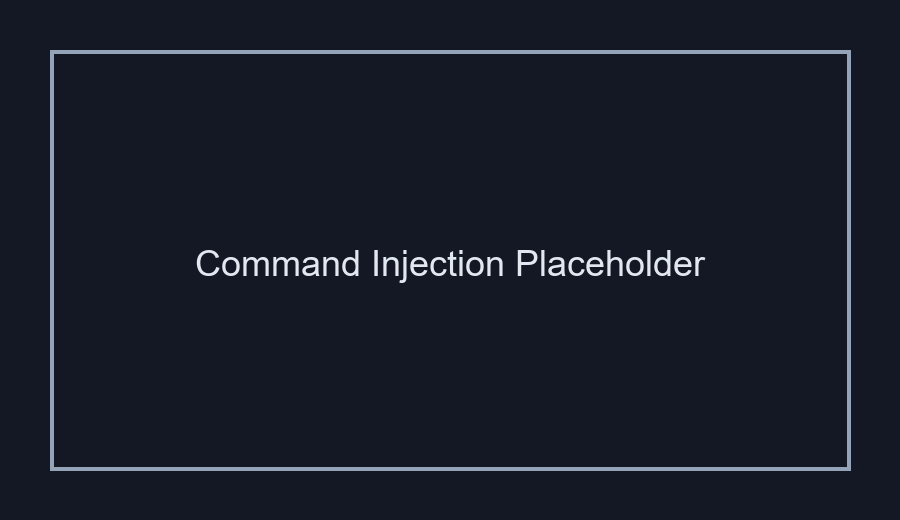

# Inyección de Comandos (Command Injection)

## 1. Evidencia del Ataque

**Payload utilizado:**  
```
127.0.0.1; cat /etc/passwd
```

**Entrada:** Campo de ping o diagnóstico del servidor  
**Resultado:** Lectura de archivos del sistema y acceso a credenciales


*La captura mostrará el navegador con DVWA y la salida del comando `/etc/passwd` listando usuarios del sistema.*

---

## 2. ¿Por Qué Funciona Esta Vulnerabilidad?

### Problema Técnico

El código vulnerable es similar a:
```php
$host = $_GET['ip'];
$output = shell_exec("ping -c 4 " . $host);
echo $output;
```

### Análisis

Sin sanitizar la entrada, el shell **interpreta caracteres especiales** como separadores de comandos. Cuando ingresamos:
```
127.0.0.1; cat /etc/passwd
```

El shell ejecuta:
```bash
ping -c 4 127.0.0.1
cat /etc/passwd
```

**Se ejecutan DOS comandos** separados por `;`.

### Otros Separadores Peligrosos
- `;` → Ejecuta siguiente comando siempre
- `|` → Pipe (output del primero → input del segundo)
- `||` → Ejecuta siguiente si el primero falla
- `&` → Ejecución en background
- `&&` → Ejecuta siguiente si el primero tiene éxito

---

## 3. Puntaje CVSS

| Métrica | Valor |
|---------|-------|
| **CVSS v3.1** | **9.8** |
| **Severidad** | CRÍTICA |
| **Vector** | CVSS:3.1/AV:N/AC:L/PR:N/UI:N/S:U/C:H/I:H/A:H |

**Justificación:**
- **AV:N** (Red): Explotable remotamente
- **AC:L** (Bajo): Sin complejidad
- **PR:N** (Sin permisos): No requiere autenticación
- **UI:N** (Sin interacción): Sin intervención del usuario
- **C:H** (Alto): Acceso total a archivos del servidor
- **I:H** (Alto): Modificación/eliminación de archivos
- **A:H** (Alto): Ejecución de código arbitrario, DoS

---

## 4. Política de Prevención

### Medida Principal: Evitar Shell Execution

**❌ NUNCA usar shell_exec(), exec(), passthru(), system()**

**✅ Usar funciones nativas del lenguaje:**
```php
// Mal: System command execution
$output = shell_exec("ping -c 4 " . $host);

// Bien: PHP nativo
$host = escapeshellarg($host); // Solo si es absolutamente necesario
$output = shell_exec("ping -c 4 " . $host);

// ✅ MEJOR: Usar función PHP nativa
$output = gethostbyname($host); // Para resolver DNS
```

**En Node.js:**
```javascript
// ❌ Mal
const output = exec("ping -c 4 " + userInput);

// ✅ Bien: child_process con array
const { execSync } = require('child_process');
const output = execSync('ping', ['-c', '4', userInput]);
```

### Escapado de Comandos (última opción)

Si es **absolutamente inevitable** usar shell:
```php
$safe_input = escapeshellarg($user_input);
$output = shell_exec("ping -c 4 " . $safe_input);
```

`escapeshellarg()` envuelve el valor en comillas simples y escapa las comillas internas, haciendo imposible escapar.

### Validación en Entrada

```php
if (!filter_var($host, FILTER_VALIDATE_IP)) {
    die("Dirección IP inválida");
}
```

Solo permite:
- IPs válidas (si corresponde)
- Dominios válidos (si corresponde)
- Rechaza todo lo demás

### Medidas Complementarias

1. **Principio de Mínimo Privilegio:** Ejecutar con usuario de aplicación, no root
2. **SELinux/AppArmor:** Restricción de acceso al filesystem
3. **Contenedores:** Sandboxing de la aplicación
4. **Whitelisting:** Solo permitir comandos específicos pre-aprobados

---

## 5. Controles de Mitigación

### Control Inmediato
- **ELIMINAR INMEDIATAMENTE** cualquier shell_exec() que use input de usuario
- Refactorizar a funciones nativas del lenguaje
- Auditoría completa de código en busca de vulnerabilidades similares

### Control Detectivo
- Registrar intentos de ejecución de comandos con separadores especiales
- IDS/IPS que detecte payloads de command injection

### Control de Recuperación
- Cambiar credenciales del servidor (root, BD, API keys)
- Revisar logs de auditoría del SO
- Scan de malware
- Restauración desde backup limpio si se detecta compromiso

---

## Referencia
- **OWASP**: https://owasp.org/www-community/attacks/Command_Injection
- **CWE-78**: Improper Neutralization of Special Elements used in an OS Command
- **NIST**: SP 800-53 SI-10, AU-2 (Audit Events)
